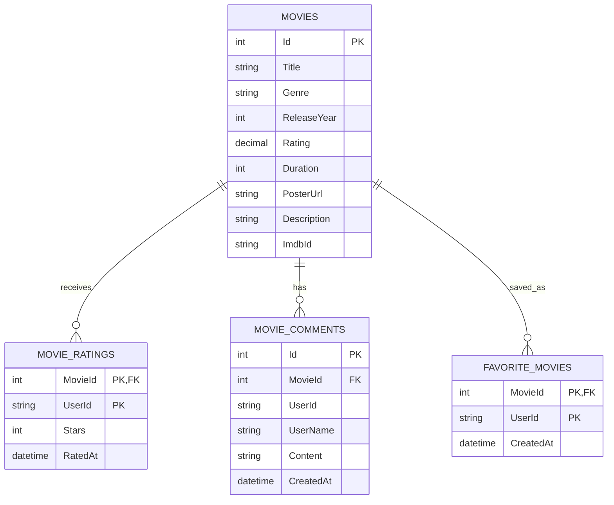
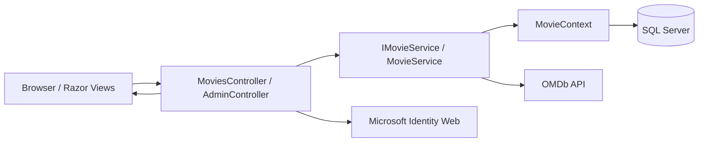

# CineScope Documentation

## ER Diagram

### Entity Notes

- `Movies` stores the local movie library, including OMDb data such as IMDb ID, poster URL, runtime, genre, plot, and imported IMDb rating.
- `MovieRatings` stores one rating per movie per user with a composite primary key of `MovieId` and `UserId`.
- `MovieComments` stores user comments for movies. Comments are deleted when their related movie is deleted.
- `FavoriteMovies` stores one favorite record per movie per user with a composite primary key of `MovieId` and `UserId`.

## User Roles

### Guest

- Can browse the movie catalog.
- Can view movie details.
- Can search for movies through the public search page.
- Must sign in before rating, commenting, or saving favorites.

### Member

- Has authenticated access.
- Can rate movies from 1 to 5 stars.
- Can post comments on movie detail pages.
- Can add or remove movies from a personal favorites list.
- Can view the personal favorites page.

### Admin

- Has all member capabilities.
- Can import movies from OMDb into the local database.
- Can seed a starter set of popular movies.
- Can edit and delete local movies.
- Can access the admin dashboard.

## API Architecture

### Application Pattern

CineScope uses ASP.NET Core MVC with Razor views:

- Controllers receive browser requests and return views, redirects, partial views, or JSON responses.
- `IMovieService` defines the movie application service contract.
- `MovieService` implements business logic, database access, rating calculations, comments, favorites, and OMDb integration.
- `MovieContext` is the Entity Framework Core database context for SQL Server.
- Microsoft Identity Web provides authentication through OpenID Connect and role-based authorization policies.

### Internal Request Flow

### Main MVC Endpoints

- `GET /Movies` displays the local movie catalog with collection rating statistics.
- `GET /Movies/Details/{id}` displays a movie, its ratings, comments, and favorite state.
- `POST /Movies/Rate` saves or updates the signed-in user's rating.
- `POST /Movies/AddComment` adds a signed-in user's comment.
- `POST /Movies/ToggleFavorite` toggles a signed-in user's favorite status and returns JSON.
- `GET /Movies/Favorites` displays the signed-in user's saved movies.
- `GET /Movies/Search` displays the OMDb search form.
- `POST /Movies/SearchMovies` searches OMDb and displays external movie results.
- `POST /Movies/ImportMovie` imports an OMDb movie into the local database. Admin only.
- `POST /Movies/SeedPopularMovies` imports a predefined popular movie set. Admin only.
- `GET /Admin/Dashboard` displays collection statistics and admin tools. Admin only.

### External API Integration

The app calls the OMDb API from `MovieService`:

- Search uses `https://www.omdbapi.com/?s={searchQuery}&apikey={key}`.
- Movie details use `https://www.omdbapi.com/?i={imdbId}&apikey={key}`.
- OMDb responses are mapped into `MovieModel` records before they are shown or saved.

### Security

- Authentication is configured with Microsoft Identity Web.
- Authorization policies are registered in `Program.cs`:
  - `Admin` requires the `Admin` role.
  - `Member` allows `Member` or `Admin`.
  - `Guest` requires an authenticated user.
- Admin-only controller actions are protected with `[Authorize(Policy = "Admin")]`.
- Authenticated user features read the signed-in user's `NameIdentifier` claim and store it as `UserId`.
